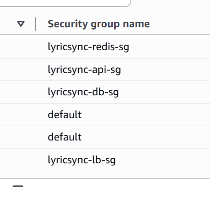

# Amazon Security Groups

## Project

**LyricSync AI SaaS**

---

# Overview

Amazon Security Groups are virtual firewalls that control inbound and outbound network traffic for AWS resources deployed inside a Virtual Private Cloud (VPC).

Unlike traditional firewalls, Security Groups are stateful. If an inbound request is allowed, the response traffic is automatically allowed without creating an additional outbound rule.

Every AWS resource such as an Application Load Balancer, Amazon ECS task, Amazon RDS database, or Amazon ElastiCache cluster can be associated with one or more Security Groups to control which network traffic is permitted.

---

# Why Security Groups Exist

Cloud applications consist of multiple services that communicate with one another.

Not every service should be publicly accessible.

For example:

- Users should be able to access the website.
- The backend API should only receive requests from the Application Load Balancer.
- The database should only accept connections from the backend.
- Redis should only communicate with backend services.

Without Security Groups, every service could potentially be exposed to unwanted network traffic, increasing security risks.

Security Groups solve this problem by allowing administrators to define exactly which traffic is permitted for each AWS resource.

---

# Why LyricSync AI Uses Security Groups

LyricSync AI is composed of multiple cloud services working together to generate karaoke videos.

These services include:

- Frontend
- FastAPI Backend
- Celery Workers
- PostgreSQL Database
- Redis Cache
- Amazon S3
- CloudWatch

Each service has different networking requirements.

Security Groups ensure that every service can communicate only with the resources it actually needs.

This follows AWS security best practices and the Principle of Least Privilege.

---

# Where Security Groups Are Used in LyricSync AI

## Application Load Balancer

The Application Load Balancer is the only internet-facing component of the application.

Its Security Group allows incoming HTTP and HTTPS traffic from users while forwarding requests to the backend.

Purpose

- Accept user requests
- Forward traffic securely
- Prevent direct access to backend services

---

## FastAPI Backend

The FastAPI backend processes API requests, authentication, file uploads, and AI processing jobs.

Its Security Group allows traffic only from the Application Load Balancer.

Purpose

- Prevent direct internet access
- Accept requests only from trusted AWS resources

---

## Celery Workers

Celery Workers process long-running background jobs such as:

- YouTube audio download
- Vocal separation
- Speech transcription
- Karaoke video rendering

Workers communicate with Redis and Amazon S3 but are never directly accessible from the internet.

Their Security Group allows communication only with required internal services.

---

## Amazon RDS PostgreSQL

The PostgreSQL database stores:

- User accounts
- Authentication data
- Processing jobs
- Video metadata
- Application records

The database Security Group allows connections only from the backend application.

Purpose

- Protect application data
- Prevent unauthorized database access

---

## Amazon ElastiCache Redis

Redis is used as the message broker for Celery and as an in-memory cache.

Only backend services and workers are allowed to connect.

Purpose

- Queue background tasks
- Improve application performance
- Prevent public access

---

# Benefits of Security Groups

Using Security Groups provides several advantages.

## Improved Security

Only approved traffic is allowed to reach AWS resources.

---

## Least Privilege Networking

Every AWS service receives only the network permissions it actually requires.

---

## Reduced Attack Surface

Backend services, databases, and internal components remain inaccessible from the public internet.

---

## Controlled Service Communication

Only trusted AWS resources can communicate with each other.

Examples include:

- Load Balancer → Backend
- Backend → Database
- Backend → Redis

---

## Stateful Firewall

Security Groups automatically allow return traffic for approved connections, reducing firewall complexity.

