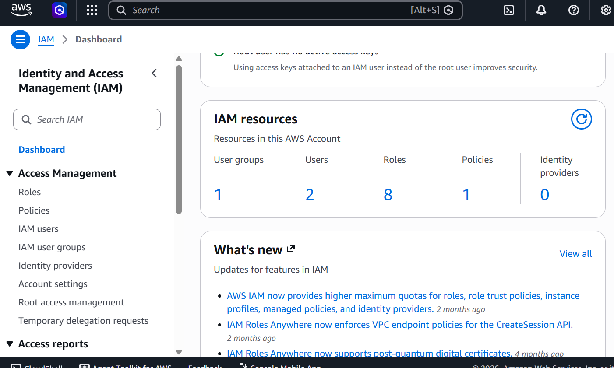

# IAM Configuration

## Project
LyricSync AI SaaS

## Purpose

AWS Identity and Access Management (IAM) is used to securely manage authentication, authorization, and permissions for AWS resources while following the Principle of Least Privilege.

---

## What I Implemented

###  IAM User

Created a dedicated IAM user for daily development instead of using the AWS root account.

**Reason**
- Improves security
- Prevents accidental changes using the root account

---

###  IAM Group

Created a Developers group and added the IAM user to the group.

**Reason**
- Permissions can be managed centrally.
- Easier to manage multiple developers.

---

###  Custom IAM Policy

Created a custom IAM policy that provides Cost Explorer and Billing access.

**Purpose**
- View AWS billing information
- Monitor monthly costs
- Access Cost Explorer
- Follow least-privilege principles instead of granting full administrator permissions

---

### ✅ IAM Role

Created an IAM role to understand role-based access in AWS.

This will later be used by AWS services such as:
- Amazon ECS
- AWS Lambda
- EC2
- Other AWS services

---

## Security Practices

- Root account is not used for daily work.
- MFA enabled for IAM user.
- Permissions are managed through IAM Groups.
- Custom IAM policies follow the Principle of Least Privilege.
- IAM Roles are used instead of long-term credentials whenever possible.

---

## Screenshots

